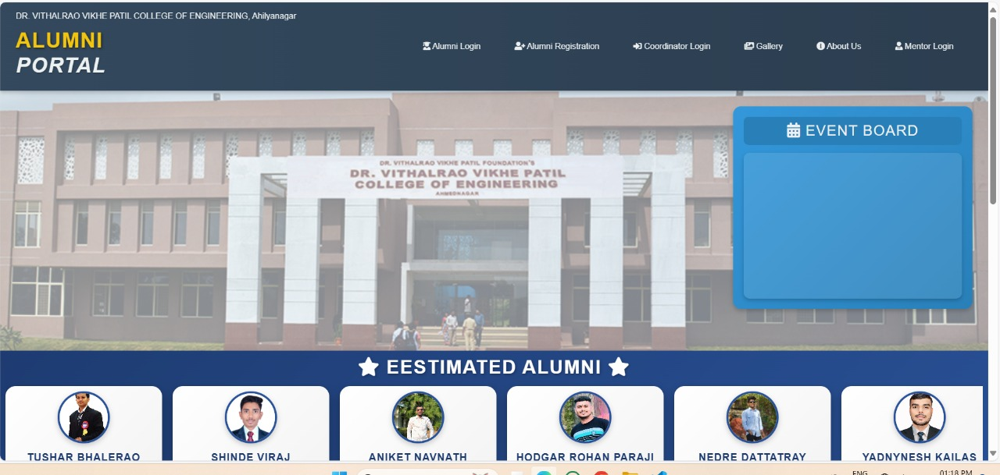

# 🎓 Alumni Management Portal

## 📌 Abstract
The **Alumni Management Portal** is a web-based application designed to connect alumni with their alma mater.  
It provides features like alumni registration, login, profile management, event announcements, and an admin dashboard for managing alumni data.  

This project was developed as part of my academic coursework, demonstrating concepts of **full stack web development, database management, and system design**.  

---

## 🛠️ Tech Stack
- **Frontend**: HTML, CSS, JavaScript (Angular/React for extended UI)  
- **Backend**: Django (Python) / Java Spring Boot (academic build)  
- **Database**: MySQL / SQLite  
- **Tools**: Git, Postman, VS Code  

---

## 📂 Repository Structure
Alumni-Management-Portal/
│
├── 📄 README.md → Project overview
│
├── 📂 backend/ → Backend implementation (Django / Spring Boot)
│
├── 📂 frontend/ → UI/UX design (HTML, CSS, JS)
│
├── 📂 docs/ → Documentation (Report, Abstract, PPT)
│
├── 📂 media/ → Screenshots & demo thumbnail
│
└── 📂 database/ → Sample DB schema (if allowed)

---

## 📸 Screenshots
### Homepage

### Alumni Dashboard

---

## 🎥 Demo Video
👉 [Watch on YouTube](https://youtu.be/QnpqTdHmBTs?si=deD-nLsrwdqzAbON)  

---

## 📑 Documentation
- [📄 Project Stage -1 Report](1- Documentation/Report 1-stage.pdf)  
- [📄 Project Stage -2 Report](1- Documentation/Report 2-stage.pdf)    
- [📄 Abstract](1- Documentation\Abstraction.pdf)  
- [📊 Presentation PPT](1- Documentation\Presentation.pptx)  

---

## ✨ Features
- Alumni **registration & login**  
- Profile update & alumni directory  
- Department-wise alumni records  
- Event board & announcements  
- Admin dashboard for data management  

---
